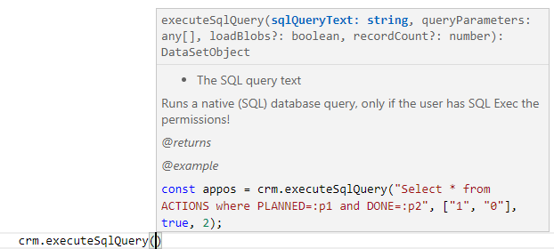
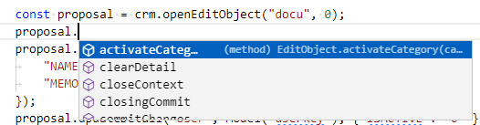

# Efficy Enterprise API

## Introduction

The Efficy Enterprise API is developed for server-side usage in a [Node.js](https://nodejs.org/en/) environment (e.g. for integrations) and also bundled for usage inside an Efficy browser session for client-side JSON RPC requests.

## Node.js instructions

In your [Node.js](https://nodejs.org/en/) project, first install the [efficy-enterprise-api](https://www.npmjs.com/package/efficy-enterprise-api) npm package.

**powershell**
```powershell
npm i efficy-enterprise-api
```

```javascript
import { CrmEnv, CrmRpc} from "efficy-enterprise-api";

const crm = new CrmRpc(crmEnv); // See CrmEnv class
const compSearch = crm.search("comp", "SEARCHFAST", "Efficy");
await crm.executeBatch();

// Debug output
compSearch.items; // An array of row items
```

## Efficy in browser instructions

Switch and use the [efficy-enterprise-api-browser](https://www.npmjs.com/package/efficy-enterprise-api-browser) npm package.

**powershell**
```powershell
npm i efficy-enterprise-api-browser
```
Use [ES import](https://developer.mozilla.org/en-US/docs/Web/JavaScript/Reference/Statements/import) and not [AMD RequireJs](https://requirejs.org/docs/whyamd.html), to benefit from the [jsDoc](https://jsdoc.app/) instructions and intellisense in supporting IDE's such as Visual Studio Code.

```javascript
const {CrmRpc} = await import('../../../node_modules/efficy-enterprise-api-browser/es.js');
const crm = new CrmRpc();

const proposal = crm.openEditObject("docu", 0);
proposal.updateFields({
	"NAME": "Non committed proposal",
	"MEMO": "Line1\nLine2"
});
proposal.insertDetail("Oppo", Model("key"));
proposal.insertDetail("Comp", Model("K_COMPANY"));
proposal.insertDetail("Cont", Model("K_CONTACT"));
await crm.executeBatch();

// Debug output
proposal.edithandle; // The editHandle number, can be used to open an edit page
```

## Intellisense

Use [ES import](https://developer.mozilla.org/en-US/docs/Web/JavaScript/Reference/Statements/import) and not [AMD RequireJs](https://requirejs.org/docs/whyamd.html), to benefit from the [jsDoc](https://jsdoc.app/) instructions and [intellisense](https://code.visualstudio.com/docs/languages/javascript#_intellisense
) in supporting IDE's such as Visual Studio Code.

Methods on the general [CrmRpc](CrmRpc.html) object



Methods from [EditObject](EditObject.html)



## Get started

Learn the available public [CrmRpc](CrmRpc.html) methods and properties

## Tutorials

1. [How to configure your CRM environment](tutorial-CRM%20Environment.html)
2. [How to insert a document with relations, categories and reference](tutorial-Insert%20document.html)
3. [How to edit and open new non-committed Proposal](tutorial-Edit%20new%20proposal.html)
4. [How to execute Queries and Searches](tutorial-Execute%20Queries%20and%20Searches.html)

## Contribute

The Efficy Enterprise API is developed with Visual Studio Code and [Node.js](https://nodejs.org/en/) v16.13.2.
Follow these [contribution instructions](tutorial-Contribute.html) to configure your development environment.
